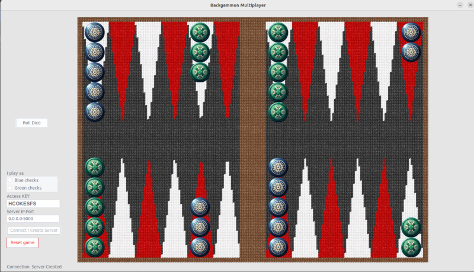

# Backgammon Multiplayer

This is a Backgammon Multiplayer that enables you to play with your friends over IP networks (e.g. Internet).

## Features, rules, and limitations

The game must be played cooperatively as the game logic is not implemented.
* Multiplayer over network
* Animated opponent movements
* One-Time token client authentication using pre-shared secret
* Server rolls the dice first
* Opponents should agree on their checks' color before starting the game
* No automatic rule applying
* No TLS (using socket.io events)

## Installation

Open a Terminal in Linux (cmd in Windows), and follow the instructions.

**Clone the game repository**  
`git clone https://github.com/mahboobkarimian/Backgammon-Multiplayer-Remote.git`

**Go to the game directory**  
`cd Backgammon-Multiplayer-Remote`

**Create a virtual environment**  
`python3 -m venv ./`

**Activate virtual environment**  
Linux/Mac: `source bin/activate`  
Windows: `Scripts\activate`

**Install dependencies by pip**  
Linux/Mac: `bin/python3 -m pip install -r requirements.txt`  
Windows: `pip3 install -r requirements.txt`

**Run the game**  
Note: Always activate the virtual env before running the game!  
Linux/Mac: `source bin/activate`  
Windows: `Scripts\activate`

Now you can run  
Linux/Mac: `bin/python3 Backgammon.py`  
Windows: `Scripts\python.exe Backgammon.py`

## How to play

**Server**:

1. Open and forward a desired port from your home Internet router to the server machine.
2. Run the game GUI, enter the previously opened/forwarded port, and create a server (No need to modify the IP).
3. Enter a custom access key or let it to be generated randomly.
4. Share your public IP:PORT and access key with your friend.

**Client**:

1. Get server IP:PORT and access key from your friend.
2. Run the game GUI, enter IP:PORT, and access key then click Connect.
3. Wait for the opponent to roll the first dice, then it will be your turn to roll.

**Both**:

Who has the bigger value should start the game. The two dice will roll per click on the roll button. Dice roll will be disabled for you once you roll and it will be handed over to the opponent.

 

## TODO
* Investigate secure token exchange or use TLS
* Add Doubling dice
* Display game rounds and points
* Extend board layouts and check colors

## Contributions

Everyone willing to fork and contribute to the development and extension of the game is welcomed.

### Original project source

This source implemented the GUI for the game. Drastic modifications in the code and images were applied.
https://github.com/EdenSiles/Backgammon.git